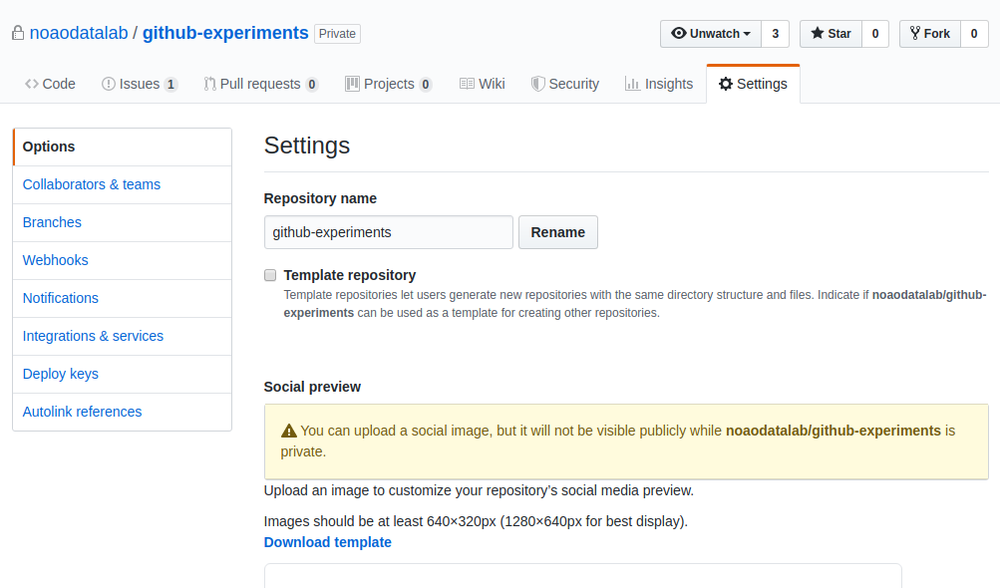
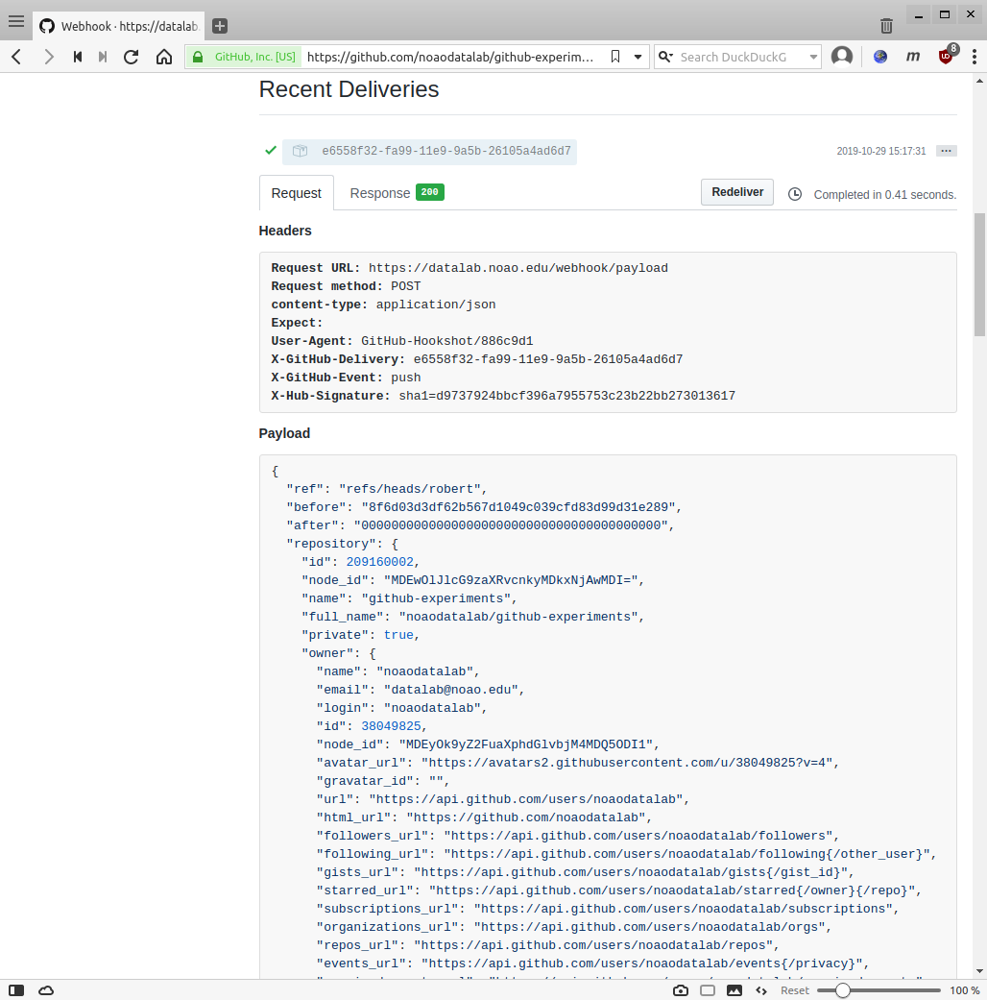

# Fun with Github webhooks

## Table of Contents

1. [Introduction](#introduction)
2. [Prerequisites](#prerequisites)
3. [Webhooks server-side](#serverside)
    1. [Setting up a webhook on a Github repository](#serverside-setup)


<a name="introduction"></a>
## Introduction

Github repositories can be configured to send http(s) web requests to
outside servers when a definable activity (called an "Event" or
"Trigger") has occured on the repository at Github's side (e.g. a
push, merge, pull-request opened, comment made, and many others).

<a name="prerequisites"></a>
## Prerequisites

We assume that you have a Github account and are familiar with basic
git terminology, i.e. you know how to make a repository, clone it,
make changes to its content, commit the changes, and push them back to
Github.

<a name="serverside"></a>
## Webhooks server-side

<a name="serverside-setup"></a>
### Setting up a webhook on a Github repository

For the purpose of this tutorial, we will work with a repository
`github-experiments`, for which we will set up webhooks.



### Structure of a webhook

A webhook is a simply data sent via simple POST request from Github to
a webserver endpoints that is configured to receive such requests.

The request has two parts: a header and a payload.

An example of a delivered webhook, with header and payload, is shown
below (to see for yourself, in this repository *Settings* on Github,
click on *Webhooks*, then on *Edit* next to the webhook in question,
and scroll down to *Recent deliveries*, and finally click on one of
the delivery checksums.



The header contains basic information about the request and may look
for instance like this:

```
Request URL: https://datalab.noao.edu/webhook/payload
Request method: POST
content-type: application/json
Expect: 
User-Agent: GitHub-Hookshot/886c9d1
X-GitHub-Delivery: e6558f32-fa99-11e9-9a5b-26105a4ad6d7
X-GitHub-Event: push
X-Hub-Signature: sha1=d9737924bbcf396a7955753c23b22bb273013617
```

Note that this is a `POST` request to our server enpoint URL
`https://datalab.noao.edu/webhook/payload`, and that the Event that
triggered this webhook delivery (*X-GitHub-Event*) was `push`.

Every header will contain th field *X-Hub-Signature* which we will
later use to [validate each received webhook](#validating).

### Triggering webhook / send beacon


## Webhooks on our side

Need a service endpoint to listen to the incoming beacons.

Testing on the live webserver is not an option (need to change code
fast as we experiment), so we tried to set up a VM running on Amazon's
EC2. [TODO: write a separate howto on that, and link here]

We ended up developing and testing on dltest (the DL test machine). 

### Receiving

<a name="validating"></a>
### Validating

... which contains a string like
`sha1=d9737924bbcf396a7955753c23b22bb273013615`. This is the SHA1
hashsum of the payload part of the webhook, computed using a secret
that we shared with the Github webhook machinery when we were setting
up the webhook.


### Acting upon validated reception

## References

Github webhooks developer guide: https://developer.github.com/webhooks/

List of available Events: https://developer.github.com/webhooks/#events

Event types and payload API (detailed) documentation: https://developer.github.com/v3/activity/events/types/
