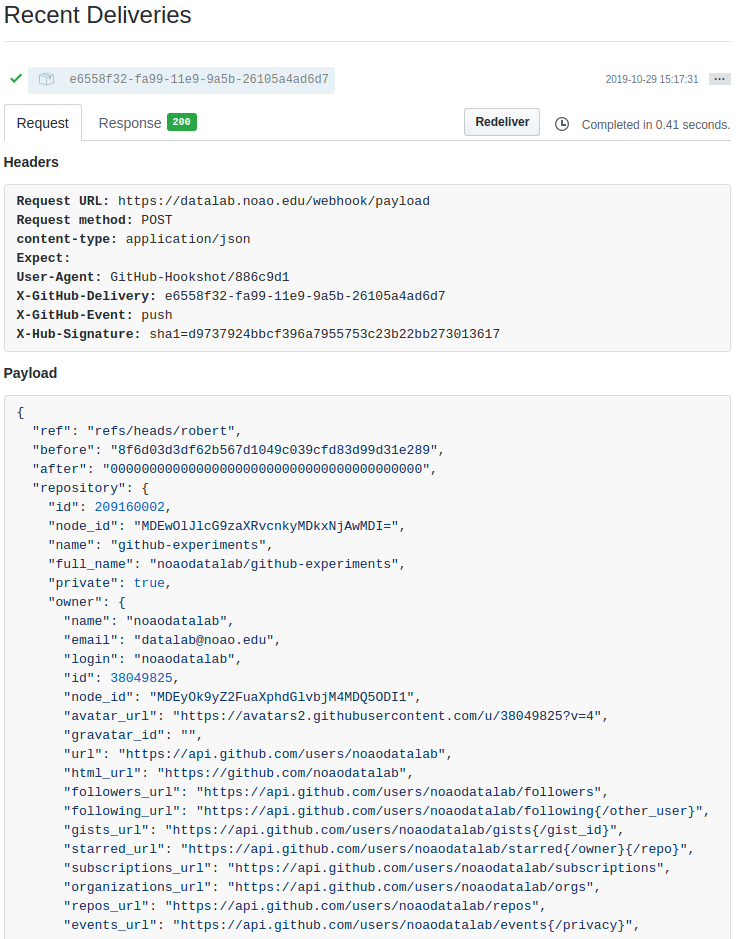

# Update `notebooks-latest/` locally (on DL end) using webhooks

## Table of Contents

1. [Introduction](#introduction)
2. [Prerequisites](#prerequisites)
3. [Webhooks server-side](#serverside)
    1. [Setting up a webhook on a Github repository](#serverside-setup)
    2. [Structure of a webhook](#webhookstructure)
    3. [Triggering webhook / send beacon](#triggering)
4. [Webhooks on our side](#ourside)
   1. [Receiving](#receiveing)
   2. [Validating](#validating)
   3. [Acting upon validated reception](#actingupon)
5. [References](#references)


<a name="introduction"></a>
## Introduction

Github repositories can be configured to send http(s) web requests to
outside servers when a definable activity (called an "Event" or
"Trigger") has occured on the repository on Github's side (e.g. a
push, merge, pull-request opened, comment made, and many others).

If an app on the target server is set up to receive those web
requests, their presence (_"I received a beacon!"_) and/or content
(the beacons come with a payload) can be used to perform any number of
actions on the receiver side.

One possibility is for instance to use the reception of a qualified
beacon as a signal to update the local repository of notebooks. In
this tutorial we are going to focus on this case; but the
possibilities are infinite.

<a name="prerequisites"></a>
## Prerequisites

We assume that you have a Github account and are familiar with basic
git terminology, i.e. you know how to make a repository, clone it,
make changes to its content, commit the changes, and push them back to
Github.

<a name="lifecycle"></a>
## Update process lifecycle


<a name="serverside"></a>
## Webhooks server-side

<a name="serverside-setup"></a>
### Setting up a webhook on a Github repository

For the purpose of this tutorial, we will work with a repository
`github-experiments`, for which we will set up webhooks.

As the owner or admin of the repository, go to the _Settings_ tab:


Then on the left-hand side click left on _Webhooks_:


You will see here all webhooks added (active and inactive) that have
been already set up for this repository, or none if we are just
starting out. Let's add a new webhook. Click on the "Add webhook"
button, it will bring you to this form:


To set up a webhook on Github we always need these pieces of information:

* A payload URL -- That's the URL that a triggered webhook will send it's "payload" to

  For our experiment here, the payload-receiving URL (running on the
  machine we control) will be `https://datalab.noao.edu/webhook/receive`

* Content type -- Select `application/json`

* Secret -- A long random string that will be used by Github to
  generate a hashsum of the payload; we need it to verify that
  incoming webhooks are actually being sent by Github and not an imposter (more in #validating)

- Select which events should trigger a webhook -- Here, select "Just the push event"

- Finally, you can set a webhook active or inactive -- Set ours to "Active"

<!--
'  ; when we receive the payload, we
'  con compute the hashsum of the payload ourselves (since we do share
'  this secret with Github), and compare our hashsum with the one
'  generated by Github. If they are identical, we can be fairly certain
'  that the payload actually came from someone who knows our secret
'  string (that's hopefully Github!)
-->

<a name="webhookstructure"></a>
### Structure of a webhook

A webhook is a simply data sent via simple POST request from Github to
a webserver endpoints that is configured to receive such requests.

The request has two parts: a header and a payload.

An example of a delivered webhook, with header and payload, is shown
below (to see for yourself, in this repository *Settings* on Github,
click on *Webhooks*, then on *Edit* next to the webhook in question,
and scroll down to *Recent deliveries*, and finally click on one of
the delivery checksums.



The header contains basic information about the request and may look
for instance like this:

```
Request URL: https://datalab.noao.edu/webhook/payload
Request method: POST
content-type: application/json
Expect: 
User-Agent: GitHub-Hookshot/886c9d1
X-GitHub-Delivery: e6558f32-fa99-11e9-9a5b-26105a4ad6d7
X-GitHub-Event: push
X-Hub-Signature: sha1=d9737924bbcf396a7955753c23b22bb273013617
```

Note that this is a `POST` request to our server enpoint URL
`https://datalab.noao.edu/webhook/payload`, and that the Event that
triggered this webhook delivery (*X-GitHub-Event*) was `push`.

Every header will contain th field *X-Hub-Signature* which we will
later use to [validate each received webhook](#validating).

<a name="triggering"></a>
### Triggering webhook / send beacon


<a name="ourside"></a>
## Webhooks on our side

Need a service endpoint to listen to the incoming beacons.

Testing on the live webserver is not an option (need to change code
fast as we experiment), so we tried to set up a VM running on Amazon's
EC2. [TODO: write a separate howto on that, and link here]

We ended up developing and testing on dltest (the DL test machine). 

<a name="receiving"></a>
### Receiving

Implement an `/receive` api to subscribe only to certain events that 
meet the criteria. For example, this example webhook only checks for 
the events that push to the master branch of `github-experiments` repository.
So it only checks for the following conditions:

 1. In the request header, the 'X-Github-Event' needs to be 'push'.
 2. The branch name of the event needs to be 'master'.
 3. The repository name needs to be `github-experiments`.

<a name="validating"></a>
### Validating

For security reason, it is also necessary to limit the requests only to 
 those from github. Among all the options, we chose to use a secret token
 which is randomly generated string, we shared with the Github webhook 
 machinery when we were setting up the webhook. On the server side, we are 
 checking the `X-Hub-Signature` field, which contains a string like
`sha1=d9737924bbcf396a7955753c23b22bb273013615`. This is the SHA1
hashsum of the payload part of the webhook, computed using the secret token
mentioned above.


<a name="actingupon"></a>
### Acting upon validated reception

Once the request is validated using SHA1 mechanism, and also meet the certain
criteria, you could choose to call the function you would like the webhook to
trigger. For our scenario, a script that updates the notebooks is triggered on 
the notebook-server.
<a name="references"></a>
## References

Github webhooks developer guide: https://developer.github.com/webhooks/

List of available Events: https://developer.github.com/webhooks/#events

Event types and payload API (detailed) documentation: https://developer.github.com/v3/activity/events/types/
